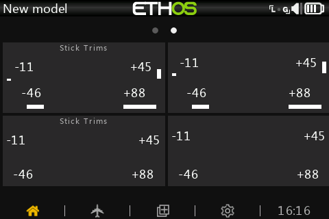
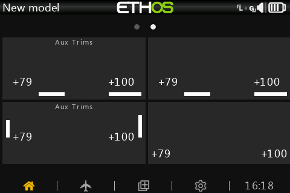

# Ethos Lua Scripts and Widgets

This repository contains various Lua knick knacks for Ethos.

## Stick Trims Widget

This widget displays the four main trim values.

Features:

* Each trim can be displayed or hidden.
* Bar indicators can be displayed or hidden.
* Automatically adapts to transmitter stick mode.
* Automatically adjusts font based on widget size.

## Aux Trims Widget

Similar to Stick Trims, this widget displays the two aux trim values (if present on your radio).

Features:

* Each trim can be displayed or hidden.
* Bar indicators can be displayed or hidden.
* Bar indicators can be displayed either horizontally or vertically.
* Automatically adjusts font based on widget size.